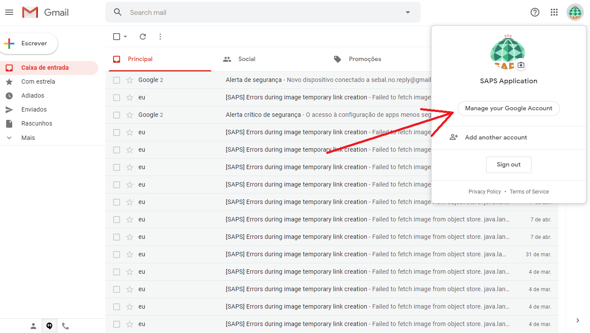
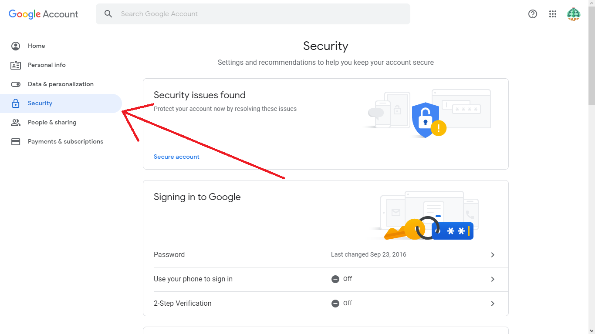
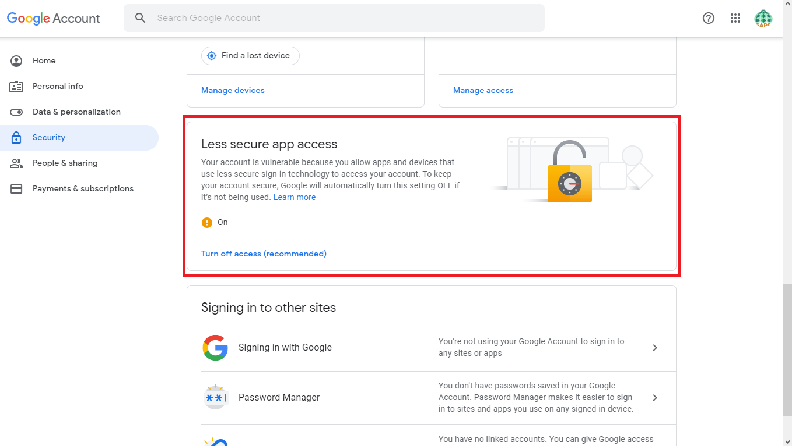

# Install and Configure Dispatcher

The SAPS Dispatcher component is responsible for registering new tasks to the Catalog Service. In addition to this feature, the Dispatcher is also responsible for the sign up of new user and the notification of the users about finished tasks.
  
## Dependencies

In an apt-based Linux distro, type the below commands to install the Dispatcher dependencies.

```bash
sudo apt-get update
sudo apt-get -y install openjdk-8-jdk \
                        maven \
                        git
sudo apt-get -y install curl jq sed
sudo apt-get -y install python-swiftclient \
                        python-gdal \
                        python-shapely
```

In addition to the installation of the above Linux packages, the Dispatcher source code should be fetched from its repository and compiled. This could be done following the below steps:

```bash
# saps-engine repository
git clone https://github.com/ufcg-lsd/saps-engine
cd saps-engine
git checkout develop
mvn install -Dmaven.test.skip=true
```

## Configure

Edit the files:
- [Dispatcher configuration file](/config/dispatcher.conf) to allow its communication with the SAPS Catalog and Permanent Storage.

- [SAPS Scripts](/resources/execution_script_tags.json) to make available new versions of the algorithms, for the three steps of the SAPS workflow (input downloading, preprocessing and processing). Any new algorithm should be packed as a docker image. See below example on how to specify the algorithms:
    
```json
{
"inputdownloading":[
    {
      "name": "$name_inputdownloading_option1",
      "docker_tag": "$docker_tag_inputdownloading_option1",
      "docker_repository": "$docker_repository_inputdownloading_option1"
    }
  ],
  "preprocessing":[
    {
      "name": "$name_preprocessing_option1",
      "docker_tag": "$docker_tag_preprocessing_option1",
      "docker_repository": "$docker_repository_preprocessing_option1"
    }
  ],
  "processing":[
    {
      "name": "$name_processing_option1",
      "docker_tag": "$docker_tag_processing_option1",
      "docker_repository": "$docker_repository_processing_option1"
    },
    {
      "name": "$name_processing_option2",
      "docker_tag": "$docker_tag_processing_option2",
      "docker_repository": "$docker_repository_processing_option2"
    }
  ]
}
```

- The `$noreply_email` and `$noreply_password` will be used by the SAPS deploy to send email notifications. However, in the current version, it is necessary to enable a setting that allows access to the less secure app, so do the following steps:

### Gmail

Sign in to your Gmail account and go to **Manage your Google account**


Then, navigate to **Security** settings


Look for **Less secure app access** and enable it


- The `$openstack_object_store_service_key` property in [Dispatcher configuration file](/config/dispatcher.conf) is used to access Object Store. After creating a new key, it must be configured using the command:

```bash
swift post -m "Temp-URL-Key:$openstack_object_store_service_key" --os-auth-url $openstack_identity_service_api_url --auth-version 3 --os-user-id $openstack_user_id --os-password $openstack_user_password --os-project-id $openstack_project_id
```

Note: ```-auth-version``` is the version of the deployed Openstack Identity Service API

## Test

### Openstack Object Store Service Key

Run the following command to check the current configuration of your Openstack Project Object Store:

```bash
swift stat --os-auth-url $openstack_identity_service_api_url --auth-version 3 --os-user-id $openstack_user_id --os-password $openstack_user_password --os-project-id $openstack_project_id
```

Expected output:
```bash
                    Account: # ignore
                 Containers: # any value other than "0"
                    Objects: # any value other than "0"
                      Bytes: # any value other than "0"
          Meta Temp-Url-Key: # $openstack_object_store_service_key also the one configured in /config/dispatcher
X-Account-Bytes-Used-Actual: # any value other than "0"
                X-Timestamp: # ignore
                 X-Trans-Id: # ignore
               Content-Type: text/plain; charset=utf-8
              Accept-Ranges: bytes
```

Unexpected output:
```bash
                    Account: # ignore
                 Containers: 0
                    Objects: 0
                      Bytes: 0
                X-Timestamp: # ignore
X-Account-Bytes-Used-Actual: 0
                 X-Trans-Id: # ignore
               Content-Type: text/plain; charset=utf-8
              Accept-Ranges: bytes
```

If your result is equal to the unexpected, return to the [configure section](https://github.com/ufcg-lsd/saps-engine/blob/develop/docs/dispatcher-install.md#configure) where we mentioned about openstack object store service key property.

## Run

Once the configuration file is edited, the below commands are used to start and stop the Dispatcher component.

```bash
# Start command
bash bin/start-dispatcher
```

```bash
# Stop command
bash bin/stop-dispatcher
```

