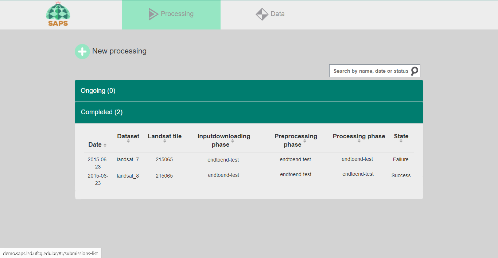
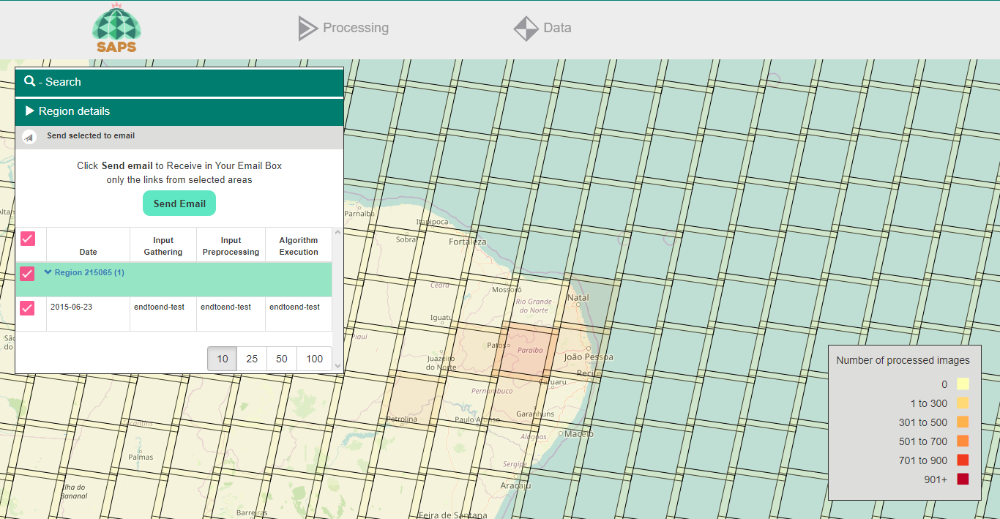

# Overview

This test aims to simulate the SAPS processing pipeline using test scripts.

# Test flow


1. User submits a task (new processing) to the Dashboard
2. Dashboard forwards the processing request to the Dispatcher
3. Dispatcher adds new processing information to the Catalog
4. Scheduler retrieves the new information entered for processing
5. Scheduler submits the task to a Job Scheduler Service that will process the scripts
6. Archiver retrieves job information already processed for archiving the resulting data
7. Archiver sends data to Permanent Storage
8. User requests the completed task data
9. Dashboard forwards the order to the Dispatcher
10. Dispatcher generates links to access Permanent Storage of job data
11. Dispatcher sends an email to the User with access links

# Configure

It is necessary to configure the scripts that will be used by the SAPS pipeline to be able to produce the same result expected by the test, for that, we must configure three components to recognize these test scripts.

**Note: After the changes, it is necessary to restart the components**

### Configuring Dashboard

In the [SAPS script file](/public/dashboardApp.js) replace the value of the variable `scriptsTags` by:

```javascript
let scriptsTags = 
{
"inputdownloading":[
    {
      "name": "endtoend-test",
      "docker_tag": "endtoend-test",
      "docker_repository": "fogbow/inputdownloading"
    }
  ],
  "preprocessing":[
    {
      "name": "endtoend-test",
      "docker_tag": "endtoend-test",
      "docker_repository": "fogbow/preprocessor"
    }
  ],
  "processing":[
    {
      "name": "endtoend-test",
      "docker_tag": "endtoend-test",
      "docker_repository": "fogbow/worker"
    }
  ]
}
```

### Configuring Dispatcher and Scheduler

In the [SAPS script file](/resources/execution_scripts_tags.json) replace it with the following json:

```json
{
"inputdownloading":[
    {
      "name": "endtoend-test",
      "docker_tag": "endtoend-test",
      "docker_repository": "fogbow/inputdownloading"
    }
  ],
  "preprocessing":[
    {
      "name": "endtoend-test",
      "docker_tag": "endtoend-test",
      "docker_repository": "fogbow/preprocessor"
    }
  ],
  "processing":[
    {
      "name": "endtoend-test",
      "docker_tag": "endtoend-test",
      "docker_repository": "fogbow/worker"
    }
  ]
}
```

# Run

### 1. Login to the Dashboard


Access the GUI through the url ```$dashboard_access_ip:$dashboard_access_port``` and connect using valid credentials.

### 2. Create new processing


When connecting successfully, click on `New Processing`, fill in the fields as in the image above and click on `Process`

### 3. New processing created


After a few seconds, it will be possible to observe the image above, that is, two new processes have been created and are in the initial state (`Created`), wait for at least half an hour until they are completed.

### 4. Processing completed



After the two processes are completed, the GUI will be similar to the image above, one with LANDSAT 8 with a successful end state (`Success`) and the other with LANDSAT 7 with a failed end state (`Failure`).

# Check results

### 1. Data tab


In the data tab, fill in the fields as shown in the image above and click on `Search`.

### 2. Send email



After completing the search, the result shown in the image above will be displayed, check the option with the information of the processing done and click on `Send email`.

### 3. Download datas

Check your inbox, SAPS will prepare several links to download data for the completed task.

### 4. Comparing results

Here is a table with the expected checksum for each file and how to calculate the checksum for each file for comparison.

