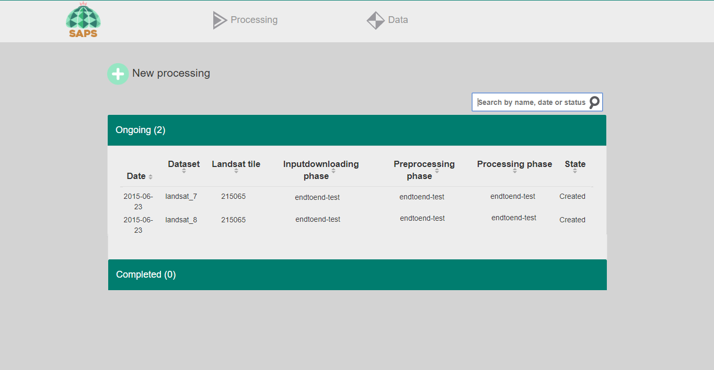

# Overview

This test aims to simulate the SAPS processing pipeline using test scripts.

# Test flow


1. User submits a task (new processing) to the Dashboard
2. Dashboard forwards the processing request to the Dispatcher
3. Dispatcher adds new processing information to the Catalog
4. Scheduler retrieves the new information entered for processing
5. Scheduler submits the task to a Job Execution Service that will process the scripts
6. Archiver retrieves information already processed for archiving the resulting data
7. Archiver sends data to Permanent Storage
8. User requests the completed task data
9. Dashboard forwards the order to the Dispatcher
10. Dispatcher generates links to access Permanent Storage of job data
11. Dispatcher sends an email to the User with access links

# Configure

It is necessary to configure the scripts that will be used by the SAPS pipeline to be able to produce the same result expected by the test, for that, we must configure three components to recognize these test scripts.

**Note: After the changes, it is necessary to restart the components**

### Configuring Dashboard

In the [SAPS script file](https://github.com/ufcg-lsd/saps-dashboard/tree/master/public/dashboardApp.js) replace the value of the variable `scriptsTags` by:

```javascript
let scriptsTags = 
{
"inputdownloading":[
    {
      "name": "endtoend-test",
      "docker_tag": "endtoend-test",
      "docker_repository": "fogbow/inputdownloading"
    }
  ],
  "preprocessing":[
    {
      "name": "endtoend-test",
      "docker_tag": "endtoend-test",
      "docker_repository": "fogbow/preprocessor"
    }
  ],
  "processing":[
    {
      "name": "endtoend-test",
      "docker_tag": "endtoend-test",
      "docker_repository": "fogbow/worker"
    }
  ]
}
```

### Configuring Dispatcher and Scheduler

In the [SAPS script file](https://github.com/ufcg-lsd/saps-engine/tree/develop/resources/execution_script_tags.json) replace it with the following json:

```json
{
"inputdownloading":[
    {
      "name": "endtoend-test",
      "docker_tag": "endtoend-test",
      "docker_repository": "fogbow/inputdownloading"
    }
  ],
  "preprocessing":[
    {
      "name": "endtoend-test",
      "docker_tag": "endtoend-test",
      "docker_repository": "fogbow/preprocessor"
    }
  ],
  "processing":[
    {
      "name": "endtoend-test",
      "docker_tag": "endtoend-test",
      "docker_repository": "fogbow/worker"
    }
  ]
}
```

# Run

## Using Dashboard

### 1. Login to the Dashboard


Access the GUI through the url ```$dashboard_access_ip:$dashboard_access_port``` and connect using valid credentials.

### 2. Create new processing


When connecting successfully, click on `New Processing`, fill in the fields as in the image above and click on `Process`

### 3. New processing created



After a few seconds, it will be possible to observe the image above, that is, two new processes have been created and are in the initial state (`Created`), wait for at least half an hour until they are completed.

### 4. Processing completed


After the two processes are completed, the GUI will be similar to the image above, one with LANDSAT 8 with a successful end state (`Success`) and the other with LANDSAT 7 with a failed end state (`Failure`).

## Using CLI

Run the following code inside the saps-engine project folder:

```
bash bin/submit-task <user-email> <user-paswword> -7.413 -7.047 -37.314 -36.257 2015-06-23 2015-06-23 googleapis default ufcg-sebal <dispatcher-access-ip>:<dispatcher-access-port>
```

# Check results

### 1. Data tab


In the data tab, fill in the fields as shown in the image above and click on `Search`.

### 2. Send email


After completing the search, the result shown in the image above will be displayed, check the option with the information of the processing done and click on `Send email`.

### 3. Download datas

Check your inbox, SAPS will prepare several links to download data for the completed task.

### 4. Comparing results

Filename | md5sum
-|-
LC82150652015174LGN00_alb.nc  | c19e32ccb08080a11fbf4ff0a961a891
LC82150652015174LGN00_EF.nc | 7fc97b93fd5f00e73cd82edc4e291818
LC82150652015174LGN00_ET24h.nc | 3de5943c4c9e5047ff2318829ad65f4d
LC82150652015174LGN00_EVI.nc | b3d1592d0302edc8e115f14650f7e029
LC82150652015174LGN00_G.nc | 9be610cf8e8b9a7ca2382a3c6c492b20
LC82150652015174LGN00_LAI.nc | 1dac46d96353c901aa3fae7f2e831cc6
LC82150652015174LGN00_NDVI.nc | aa1636bb24b03f43012b5940648d2de2
LC82150652015174LGN00_Rn.nc | b75f223bcc956aee781e7e993f5fafcb
LC82150652015174LGN00_SAVI.nc | 364b20834ca8640b098669ef0aa726e8
LC82150652015174LGN00_TS.nc | 9b0d727c42d05f267c226eab1f1b1e0e


After downloading all files, run the following command below for each file in the table above and compare the result with the md5sum column

```bash
md5sum $file_path
```

`md5sum` is a program that allows you to check the integrity of files transmitted over a network, such as the Internet, request that data has not been damaged during transport. However, we will also use it to compare our results to those expected.


